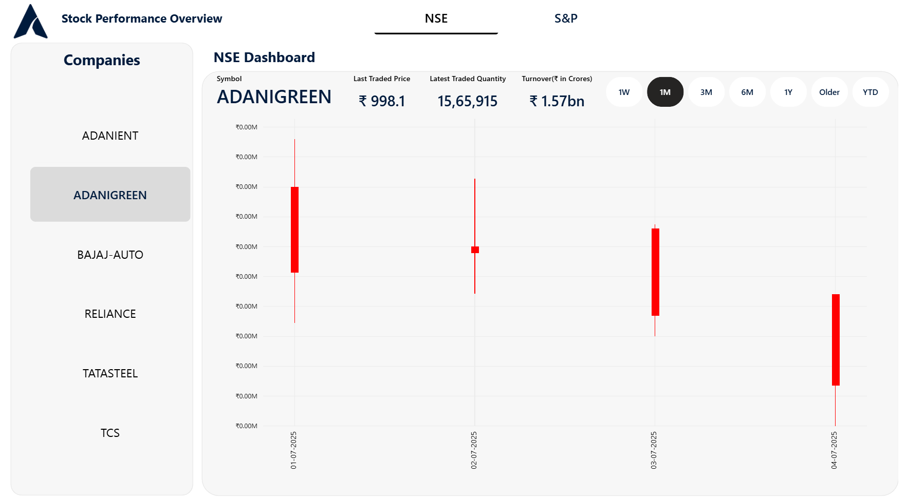

# 📊 Stock Performance Dashboard (Daxal Cosmetics)

## 📝 Project Description
Designed and developed an **interactive Stock Performance Dashboard** for **Daxal Cosmetics** to provide the **CEO and leadership team** with real-time insights into **stock performance, trends, and decision support**.  
The dashboard consolidates **NSE (India)** and **S&P (US)** market data, enabling effective follow-ups and reporting.

---

## 🔑 Key Features
- 📌 **Dual Market Coverage** – Supports **Indian NSE** and **S&P 500** company data.  
- 📌 **Interactive Candlestick Charts** – Visualizes open, close, high, and low price movements.  
- 📌 **Time-Based Filters** – Allows analysis by **1W, 1M, 3M, 6M, 1Y, YTD, Older**.  
- 📌 **Company Search & Selection** – Quick filtering of domestic & global companies.  
- 📌 **KPIs & Metrics** – Includes **opening price, price difference, % change, turnover, and traded quantity**.  
- 📌 **Benchmarking Capability** – Compare Daxal Cosmetics’ performance with industry leaders like **Apple, 3M, Abbott, Reliance, TCS, etc.**  

---

## 🛠️ Tech Stack
- **Frontend/Visualization**: Power BI / Tableau / React.js (custom dashboard)  
- **Backend & Data**: SQL, Market Data APIs  
- **Charts Used**: Candlestick, Line, Bar  

---

## 📌 Impact
- ✅ Delivered **real-time stock reporting** to the **CEO** for faster strategic decisions.  
- ✅ Improved **data-driven follow-ups** for stock performance reviews.  
- ✅ Enhanced **business insights** by comparing local (NSE) and global (S&P) companies.  

---

## 📷 Screenshots
### NSE Dashboard – Example: ADANIGREEN

### S&P Dashboard – Example: Apple (AAPL)

---

## 👨‍💻 Author
**Developed by:** Aryan Dharmesh Patel  
